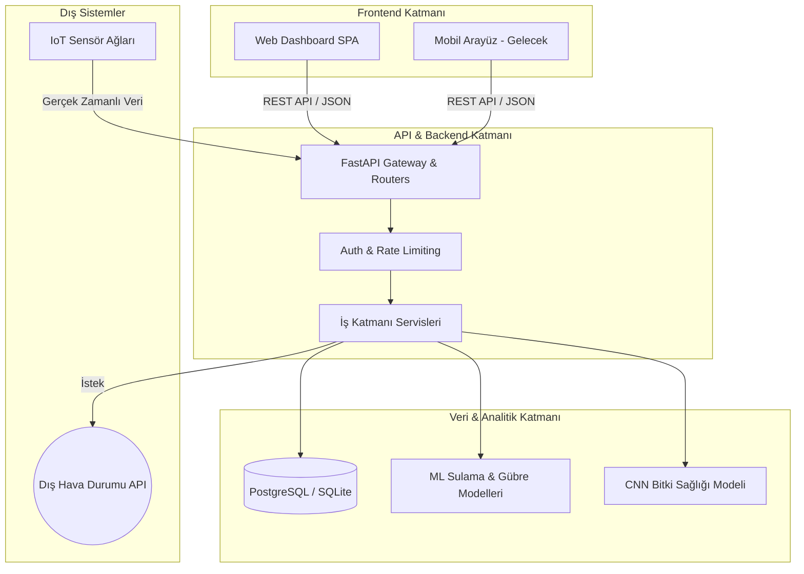

# 🌾 Akıllı Tarım Veri Analizi Platformu (SFDAP)

Çiftçilerin tarımsal verimliliğini en üst düzeye çıkarmak amacıyla toprak sensörleri, hava durumu verileri ve bitki sağlığı görüntülerini entegre bir şekilde analiz eden kapsamlı bir veri analizi ve karar destek platformudur.

[](https://github.com/Ohualtex/Smart_Farming_Data_Analysis_Platform/actions)
[](https://github.com/Ohualtex/Smart_Farming_Data_Analysis_Platform/actions/workflows/security.yml)
[](https://github.com/Ohualtex/Smart_Farming_Data_Analysis_Platform/actions/workflows/a11y.yml)


---

## 🚀 Hızlı Başlangıç

### Gereksinimler
- Python 3.12+
- Git

### Kurulum

```bash
# 1. Repoyu klonla
git clone https://github.com/Ohualtex/Smart_Farming_Data_Analysis_Platform.git
cd Smart_Farming_Data_Analysis_Platform

# 2. Sanal ortam oluştur
python -m venv venv
venv\Scripts\activate        # Windows
# source venv/bin/activate   # Mac/Linux

# 3. Bağımlılıkları yükle
pip install -r requirements.txt
pip install -r requirements-dev.txt   # Geliştirme araçları

# 4. Ortam değişkenlerini ayarla
copy .env.example .env

# 5. Demo verilerini yükle (opsiyonel)
python database/seed_data.py

# 6. API'yi başlat (Klasik Yöntem)
uvicorn app.main:app --reload

# VEYA Makefile ile (Önerilen)
make run

# VEYA Docker ile (Sadece Docker yüklüyse)
make docker-up
```

API çalışınca şu adreslerde erişebilirsin:
- 📡 **API:** http://localhost:8000
- 📖 **Swagger Docs:** http://localhost:8000/docs
- 📊 **Dashboard:** http://localhost:8000/dashboard

### 🌐 Production Deploy (HTTPS + nginx + Let's Encrypt)

Prod-hazır şablon — `nginx` reverse proxy önünde TLS termination, otomatik Let's Encrypt sertifika alma, opsiyonel PostgreSQL profili. Kurulum adımları için: **[`docs/setup/PROD_DEPLOY.md`](docs/setup/PROD_DEPLOY.md)**

```bash
# Hızlı bakış
docker compose up -d nginx api                    # API + reverse proxy
docker compose --profile letsencrypt run --rm \    # SSL cert
  certbot certonly --webroot -w /var/www/certbot ...
docker compose --profile postgres up -d db         # PostgreSQL'e geçiş
docker compose exec api alembic upgrade head       # Migration uygula
```

---

## 🌟 Temel Özellikler

| Özellik | Açıklama |
|:--------|:---------|
| 🌍 Ulusal Ölçek | Tüm Türkiye (81 il) için 7500+ kayıtlık mega veritabanı |
| 💧 Sulama Optimizasyonu | ML modeli ile toprak nemi ve hava verisi analizi |
| 🌱 Akıllı Gübreleme | NPK analizi ve toprak yapısı bazlı 17 bitki türü için öneri sistemi |
| 📊 Dashboard | Dark tema, Chart.js grafikleri, responsive SPA |
| 📈 Analitik Panosu | Bölge bazlı gruplanmış (7 bölge) veri görselleştirme ve içgörü |
| 🔐 API Güvenliği | API Key auth, rate limiting, request logging |
| 🌤️ Veri Pipeline | Hava durumu veri temizleme ve dönüştürme |
| 🗄️ Migration | Alembic 14-tablo initial + sensor aggregate migration; `alembic upgrade head` ile prod'a uygulanır |

### 🗺️ Mevcut Özellikler

| Özellik | Durum |
|:--------|:-----:|
| 🌱 Filiz Maskot ve UX cilası — animasyonlu SVG asistan + tema toggle | ✅ |
| 🦠 Bitki Hastalığı Tespiti — heuristic + ONNX-ready CNN sarıcısı | ✅ |
| 🔐 Auth UI ve backend — kullanıcı giriş/kayıt/profil (JWT + bcrypt) | ✅ |
| 🚨 İzleme & Uyarı Paneli — frontend + SystemAlert CRUD | ✅ |
| 📡 IoT/MQTT stream simülasyonu (paho-mqtt + publisher) | ✅ |
| 📊 Model performans dashboard'u — log + summary + drift detection | ✅ |
| 🛡️ Observability — Sentry + Prometheus + structured JSON log | ✅ |
| ♿ A11y — skip-link, ARIA, skeleton loaders, axe-core CI | ✅ |
| 💾 Backup/Restore — SQLite/PostgreSQL otomatik yedekleme + cron | ✅ |

---

## 🏗️ Sistem Mimarisi



---

## 🔐 API Kimlik Doğrulama

Yazma (POST/DELETE) endpoint'leri `X-API-Key` header'ı gerektirir. Okuma (GET) endpoint'leri herkese açıktır.

```bash
curl -X POST http://localhost:8000/api/sensors/ \
  -H "X-API-Key: dev-api-key" \
  -H "Content-Type: application/json" \
  -d '{"field_id": 1, "sensor_type": "soil_moisture", "serial_number": "S-001"}'
```

---

## 📡 API Endpoint'leri

### Health & Root
| Method | Endpoint | Açıklama | Auth |
|:-------|:---------|:---------|:----:|
| GET | `/` | API bilgisi | ❌ |
| GET | `/api/health` | Sığ sistem durumu | ❌ |
| GET | `/api/health/deep` | Derin sağlık (DB latency, scheduler, freshness, alerts) | ❌ |

### Kimlik Doğrulama
| Method | Endpoint | Açıklama | Auth |
|:-------|:---------|:---------|:----:|
| POST | `/api/auth/register` | Kullanıcı kaydı (bcrypt hash) | ❌ |
| POST | `/api/auth/login` | JWT bearer token alma | ❌ |
| GET | `/api/auth/me` | Mevcut kullanıcı | ✅ Bearer |
| POST | `/api/auth/logout` | Token iptali (blacklist) | ✅ Bearer |

> Şifre hash: `passlib[bcrypt]`. Token imzalama: `python-jose` HS256.

### Sensör Verileri
| Method | Endpoint | Açıklama | Auth |
|:-------|:---------|:---------|:----:|
| GET | `/api/sensors/` | Sensörleri listele (skip + limit pagination, default 50/sayfa) | ❌ |
| GET | `/api/sensors/count` | Toplam sensör sayısı (pagination için) | ❌ |
| POST | `/api/sensors/` | Yeni sensör ekle | ✅ |
| GET | `/api/sensors/{id}` | Sensör detayı | ❌ |
| DELETE | `/api/sensors/{id}` | Sensör sil | ✅ |
| POST | `/api/sensors/readings` | Okuma verisi ekle | ✅ |
| GET | `/api/sensors/{id}/readings` | Sensör okumaları | ❌ |

### Hava Durumu
| Method | Endpoint | Açıklama | Auth |
|:-------|:---------|:---------|:----:|
| GET | `/api/weather/` | Hava durumu verileri | ❌ |
| POST | `/api/weather/` | Hava verisi ekle | ✅ |
| GET | `/api/weather/latest/{farm_id}` | Son hava durumu | ❌ |
| POST | `/api/weather/fetch/{farm_id}` | Dış API'den veri çek | ❌ |
| GET | `/api/weather/stats/{farm_id}` | İstatistikler | ❌ |
| POST | `/api/weather/clean` | Veri temizleme | ❌ |

### Sulama (ML)
| Method | Endpoint | Açıklama | Auth |
|:-------|:---------|:---------|:----:|
| POST | `/api/irrigation/predict` | ML sulama tahmini | ❌ |
| GET | `/api/irrigation/schedules` | Sulama takvimi (skip + limit pagination, default 50/sayfa) | ❌ |
| GET | `/api/irrigation/schedules/count` | Toplam sulama programı sayısı (pagination için) | ❌ |
| POST | `/api/irrigation/schedules` | Sulama planı oluştur | ✅ |

### Gübreleme
| Method | Endpoint | Açıklama | Auth |
|:-------|:---------|:---------|:----:|
| GET | `/api/fertilizer/crops` | Desteklenen bitkiler | ❌ |
| POST | `/api/fertilizer/recommend` | NPK gübreleme önerisi | ❌ |
| POST | `/api/fertilizer/schedules` | Gübreleme takvimi | ❌ |

### Bitki Sağlığı
| Method | Endpoint | Açıklama | Auth |
|:-------|:---------|:---------|:----:|
| GET | `/api/plants/health-images` | Bitki görselleri | ❌ |
| POST | `/api/plants/health-images` | URL ile görsel kaydet | ✅ |
| POST | `/api/plants/health-images/analyze` | Multipart upload + CNN teşhis | ✅ |

### Sistem Uyarıları
| Method | Endpoint | Açıklama | Auth |
|:-------|:---------|:---------|:----:|
| GET | `/api/alerts/` | Uyarı listesi (severity + resolved filtre) | ❌ |
| GET | `/api/alerts/{alert_id}` | Tekil uyarı detayı | ❌ |
| POST | `/api/alerts/` | Manuel uyarı oluştur | ✅ |
| PATCH | `/api/alerts/{alert_id}` | Uyarıyı güncelle/çöz | ✅ |

### Model Performansı
| Method | Endpoint | Açıklama | Auth |
|:-------|:---------|:---------|:----:|
| GET | `/api/model-performance/` | Tahmin log listesi | ❌ |
| POST | `/api/model-performance/` | Yeni log kaydı | ✅ |
| PATCH | `/api/model-performance/{log_id}` | Gerçek değer doldurma | ✅ |
| GET | `/api/model-performance/summary/{model_name}` | Özet metrikler | ❌ |
| GET | `/api/model-performance/timeseries/{model_name}` | Günlük accuracy zaman serisi | ❌ |
| GET | `/api/model-performance/compare` | Multi-model karşılaştırma | ❌ |
| GET | `/api/model-performance/drift/{model_name}` | Drift tespiti + auto SystemAlert | ❌ |

### Analitik & Görselleştirme
| Method | Endpoint | Açıklama | Auth |
|:-------|:---------|:---------|:----:|
| GET | `/api/analytics/summary?days=30` | Toplu istatistik ve içgörü verileri | ❌ |
| GET | `/api/analytics/compare?start_date_1=&end_date_1=&start_date_2=&end_date_2=` | İki farklı tarih aralığını karşılaştırır | ❌ |
| GET | `/api/analytics/export?format=pdf\|xlsx&days=30` | Raporu PDF veya Excel formatında indirir | ❌ |

> **Notlar:**
> - `summary`: `days` query parametresi ile süre filtrelenebilir (varsayılan: 30 gün). Sensör dağılımı, çiftlik bazlı hava karşılaştırması, sulama durumu, günlük trendler, NPK profilleri ve sensör okuma istatistiklerini döndürür.
> - `compare`: Tüm 4 tarih parametresi (`start_date_1`, `end_date_1`, `start_date_2`, `end_date_2`) `YYYY-MM-DD` formatında zorunludur.
> - `export`: `format` parametresi yalnızca `pdf` veya `xlsx` değerini kabul eder (`excel` yerine `xlsx` kullanın).

```bash
# PDF rapor indir
curl "http://localhost:8000/api/analytics/export?format=pdf&days=30" -o rapor.pdf

# NPK gübreleme önerisi al (auth gerekmiyor)
curl -X POST http://localhost:8000/api/fertilizer/recommend \
  -H "Content-Type: application/json" \
  -d '{"crop_type":"tomato","area_hectares":1.0,"soil_nitrogen":80,"soil_phosphorus":40,"soil_potassium":50,"soil_ph":6.5}'
```

---

## 🧪 Test ve Kalite

Makefile komutları ile tüm işlemleri kolayca yapabilirsiniz:

```bash
# Tüm testleri çalıştır (Coverage raporlu)
make test

# Linting ve Format Kontrolü
make lint
make format
```

| Metrik | Değer |
|:-------|:------|
| Toplam Test | **425** |
| Coverage | **%95.04** (eşik %80; detay için [`docs/QUALITY_AUDIT.md`](docs/QUALITY_AUDIT.md)) |
| Linting | Ruff (17 kural seti, All checks passed) |
| Security | bandit (medium+) + pip-audit (CVE DB) — CI haftalık |
| Fuzz | Schemathesis property-based API fuzz (25 GET endpoint, deterministik seed) |
| A11y | axe-core WCAG 2.0 + WCAG 2.1 A/AA — CI haftalık tarama |
| CI/CD | GitHub Actions (3 workflow: ci.yml + security.yml + a11y.yml) |

---

## 🛠️ Teknoloji Stack

| Katman | Teknoloji |
|:-------|:---------|
| Backend / API | Python, FastAPI, Uvicorn |
| Veritabanı | SQLAlchemy, SQLite (dev) / PostgreSQL (prod) |
| Migration | Alembic |
| Makine Öğrenimi | Scikit-learn, NumPy, Pandas |
| Veri Doğrulama | Pydantic v2 |
| Güvenlik | SlowAPI (rate limiting), Custom middleware |
| Frontend | HTML5, CSS3, JavaScript, Chart.js |
| HTTP Client | httpx |
| CI/CD | GitHub Actions, Ruff, Pytest |

---

## 📦 Proje Yapısı

```
Smart_Farming_Data_Analysis_Platform/
├── app/                         # Ana uygulama (FastAPI)
│   ├── main.py                  #   Giriş noktası & middleware konfigürasyonu
│   ├── config.py                #   Ayar yönetimi (pydantic-settings)
│   ├── database.py              #   SQLAlchemy engine & session
│   ├── core/                    #   Logger konfigürasyonu
│   ├── models/                  #   ORM modelleri (15 tablo)
│   ├── schemas/                 #   Pydantic veri doğrulama şemaları
│   ├── routers/                 #   API endpoint'leri (11 router, 43 endpoint)
│   │   ├── sensors.py           #     Sensör CRUD
│   │   ├── weather.py           #     Hava durumu + dış API
│   │   ├── irrigation.py        #     ML sulama tahmini + auto-log
│   │   ├── fertilizer.py        #     NPK gübreleme önerisi
│   │   ├── plants.py            #     Bitki sağlığı (URL + CNN multipart)
│   │   ├── analytics.py         #     Analitik & görselleştirme verileri
│   │   ├── alerts.py            #     SystemAlert CRUD
│   │   ├── model_performance.py #     Log + summary + timeseries + drift
│   │   ├── auth.py              #     Register/login/me/logout (skeleton)
│   │   ├── metrics.py           #     /api/health/deep (derin sağlık)
│   │   └── health.py            #     Sığ sağlık (load balancer için)
│   ├── services/                #   İş mantığı katmanı
│   │   ├── weather_service.py   #     Hava durumu veri pipeline
│   │   └── fertilizer_service.py#     Gübreleme hesaplama motoru
│   ├── middleware/              #   Güvenlik & izleme katmanı
│   │   ├── auth.py              #     API Key doğrulama
│   │   ├── exceptions.py        #     Global exception handler (6 sınıf)
│   │   ├── rate_limiter.py      #     SlowAPI rate limiting
│   │   └── request_logger.py    #     Request logging
│   ├── ml/                      #   Makine öğrenimi modülleri
│   │   ├── irrigation_model.py  #     RandomForest sulama modeli
│   │   └── models/              #     Eğitilmiş model dosyaları (.pkl)
│   └── tasks/
│       └── scheduler.py         #   APScheduler periyodik görevler
│
├── frontend/                    # Web arayüzü (SPA Dashboard)
│   ├── index.html               #   Dark mode, responsive, Chart.js (9 sayfa) + a11y/ARIA + skeleton loaders
│   ├── package.json             #   Vite + axe-core CLI scaffold
│   ├── vite.config.js           #   Vite build/dev scaffold (FastAPI proxy)
│   └── README.md                #   Frontend dev kılavuzu
│
├── database/                    # Veritabanı yönetimi
│   ├── sfdap_schema.sql         #   SQL şeması
│   ├── seed_data.py             #   81 il kapsamlı mega seed data
│   └── turkey_data.py           #   Türkiye il/bölge/bitki referans verisi
│
├── alembic/                     # DB migration sistemi
├── tests/                       # 425 test (27 dosya, %95.04 coverage + Schemathesis fuzz)
├── scripts/backup.sh + restore.sh # SQLite/PostgreSQL yedek+restore
├── .github/workflows/           # CI/CD pipeline:
│   ├── ci.yml                   #   lint → test → migrations → fuzz (Schemathesis)
│   ├── security.yml             #   bandit + pip-audit (haftalık cron)
│   └── a11y.yml                 #   axe-core WCAG 2.1 AA (haftalık cron)
│
├── docs/                        # Proje dokümantasyonu
│   ├── wireframes/              #   UI/UX wireframe tasarımları (6 ekran)
│   ├── api/                     #   API kullanım kılavuzu & Postman/Swagger
│   ├── database/                #   Veritabanı şeması & sensör entegrasyonu
│   ├── research/                #   Teknoloji araştırması & veri analizi
│   ├── requirements/            #   Gereksinim belgeleri
│   ├── setup/                   #   Geliştirme ortamı kurulum rehberi
│   └── planning/                #   Veri toplama & görselleştirme planları
│
├── scripts/                     # Yardımcı scriptler & prototipler
│   ├── weather_processing.py    #   Hava durumu veri işleme (bağımsız)
│   ├── sensor_integration.py    #   Sensör entegrasyon scripti
│   ├── verify_sensor_data.py    #   Sensör veri doğrulama
│   └── api_prototype.py         #   Erken dönem API prototipi
│
├── CONTRIBUTORS.md              # Ekip & katkı matrisi
├── projeakisi.md                # Sprint bazlı görev dağılımı
├── requirements.txt             # Production bağımlılıkları
├── requirements-dev.txt         # Development bağımlılıkları
├── pyproject.toml               # Proje konfigürasyonu
└── .env.example                 # Ortam değişkenleri şablonu
```

---

## 👥 Ekip

5 kişilik geliştirici ekibi: Scrum Master + 4 geliştirici. Rol dağılımı ve cycle bazlı katkı detayı için [`CONTRIBUTORS.md`](CONTRIBUTORS.md).

---

## 📋 Sprint Planı

| Cycle | Tarih | Durum |
|:------|:------|:-----:|
| Cycle 1 | 24 Şubat – 10 Mart | ✅ Tamamlandı |
| Cycle 2 | 11 – 24 Mart | ✅ Tamamlandı |
| Cycle 3 | 25 Mart – 1 Nisan | ✅ Tamamlandı |
| Cycle 4 | 2 – 13 Nisan | ✅ Tamamlandı |
| Cycle 5 | 14 – 27 Nisan | ✅ Tamamlandı |
| Cycle 6 | 28 Nisan – 3 Mayıs | ✅ Tamamlandı |
| Cycle 7 | 3 – 10 Mayıs | ✅ Tamamlandı |
| Cycle 8 | 10 – 12 Mayıs | ⏳ Üretim hazırlığı (core) |
| **shiftFinal** *(bridge)* | 13 – 19 Mayıs | ⏳ Cila ve gözlemlenebilirlik |
| Cycle 9 | 20 – 31 Mayıs | ⏳ Final rapor ve akademik teslim |

Detaylı görev dağılımı için [projeakisi.md](projeakisi.md) dosyasına bakınız.

### 📚 Anahtar Dokümanlar

| Doküman | Açıklama |
|:--|:--|
| [`docs/FINAL_REPORT.md`](docs/FINAL_REPORT.md) | **Cycle 9 akademik teslim raporu** (iskelet — Cycle 9'da doldurulacak) |
| [`docs/CYCLE_8_RETROSPECTIVE.md`](docs/CYCLE_8_RETROSPECTIVE.md) | Cycle 8 retrospective — başarılar, zorluklar, öğrenmeler |
| [`docs/QUALITY_AUDIT.md`](docs/QUALITY_AUDIT.md) | Cycle 8 sonu kalite denetimi — Tier A/B/C yol haritası |
| [`docs/architecture.md`](docs/architecture.md) | Sistem mimarisi + Mermaid diyagramları |
| [`docs/setup/PROD_DEPLOY.md`](docs/setup/PROD_DEPLOY.md) | nginx + Let's Encrypt deploy kılavuzu |
| [`docs/api/API_Kullanim_Kilavuzu.md`](docs/api/API_Kullanim_Kilavuzu.md) | API kullanım rehberi |
| [`docs/demo_script.md`](docs/demo_script.md) | Sunum demo akışı |
