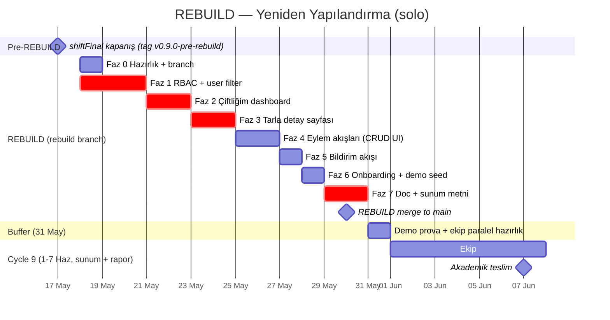

# 🛠️ REBUILD — Kullanıcı-Odaklı Yeniden Yapılandırma Roadmap

> **Karar günü:** 17 Mayıs 2026
> **Sprint:** REBUILD *(shiftFinal kapanışı sonrası, Cycle 9 öncesi)*
> **Süre:** 13 gün (18–30 Mayıs)
> **Çalışma modu:** **Solo (Miraç)** — bu pivot tek başına yürütülür; ekip Cycle 9 (1–7 Haziran) süresince **yalnız sunum + rapor** üretir
> **Branch:** `rebuild` *(shiftFinal kapatıldıktan sonra ana hattan ayrılır)*
> **Geri-dönüş tag'i:** `v0.9.0-pre-rebuild` *(17 Mayıs shiftFinal kapanışında atıldı)*
> **Vazgeçilen çerçeve:** Cycle 1–8 boyunca üretilen "bakanlık/araştırmacı paneli". Yerine: **çiftçi-odaklı, eyleme yönelik saha aracı**

---

## 🎯 Niye pivot? — Acı nokta envanteri

shiftFinal sonunda teknik kalite mükemmel: **485 backend + 32 frontend test**, %95 coverage, 6 security header, 8 audit bug fix edildi. Ama 17 May'da Miraç sordu:

> "Kullanıcı girişi bize ne özellik kazandırıyor? Tablolar veriler hiçbiri kullanılabilir gelmiyor. Bu platform kimin ne işine yarayacak?"

Dürüst tanı — **şu anki UI fiilen hiç kimseye yetmez**:

| Persona | Karşılanıyor mu? |
|---|---|
| 🧑‍🌾 Çiftçi (Ahmet) | ❌ "Benim tarlam" yok; 324 sensör listede ama hangisi onun? |
| 🏛️ Bakanlık / araştırmacı | 🟡 Harita + analytics yakın ama "indir, rapor yaz" yok |
| 🏢 Ziraat danışmanı | ❌ Çoklu çiftlik portföyü kavramı yok |
| 🛠️ SRE | 🟢 `/metrics` + Sentry + scheduler — bu kişi için iyi |

Daha kötüsü: **`/api/auth/login` boş bir vaat.** Login olsam da olmasam da aynı 81 ilin tüm sensör/çiftlik/sulama verisini görüyorum. `Farm.user_id` FK var ama hiçbir endpoint onu filter olarak kullanmıyor. "Hesabım" sayfası eylemsiz.

Bu **tech debt değil — eksik temel feature**. REBUILD bu eksikliği kapatır.

---

## 👤 Hedef persona: Çiftçi Ahmet

Tüm yeniden yapılandırmanın referansı tek bir kişi:

> **Ahmet, 47, Konya'da 8 hektarlık çiftliği var. 4 tarlasında buğday + ayçiçeği. 6 toprak nem sensörü kullanıyor. iPhone'undan tarlada bağlanıyor; bilgisayar bilgisi orta.**

Ahmet'in 5 sorusu, her ekranda cevaplanmalı:

1. **"Tarlam susuz mu, ne zaman sulayayım?"** → bugün için sulama önerisi
2. **"Bu yaprakta hastalık var mı?"** → fotoğraf yükle, anında tanı
3. **"Gübre ne zaman, ne kadar?"** → ekim takvimi + NPK
4. **"Komşulara göre durumum nasıl?"** → bölge ortalaması karşılaştırması
5. **"Bir sorun çıkarsa haberim olacak mı?"** → bildirim akışı

Şu anki sistem (1)–(3) için backend'i HAZIR ama UI bağlam vermiyor. (4)–(5) eksik.

---

## 🗓️ 7 Faz × 13 Gün — Genel Bakış



| Faz | Süre | Tarih | Çıktı | Kritiklik |
|:---:|:---:|:---:|:--|:---:|
| **0** | 1g | 18 May | Branch + plan doc + tag | 🟢 |
| **1** | 3g | 18–20 May | Per-user data isolation + RBAC | 🔴 zorunlu |
| **2** | 2g | 21–22 May | "Çiftliğim" dashboard + onboarding | 🔴 zorunlu |
| **3** | 2g | 23–24 May | Tarla detay sayfası | 🔴 zorunlu |
| **4** | 2g | 25–26 May | Eyleme yönelik CRUD UI | 🟡 önemli |
| **5** | 1g | 27 May | Per-user bildirim | 🟡 önemli |
| **6** | 1g | 28 May | Onboarding wizard + demo seed | 🟢 cila |
| **7** | 2g | 29–30 May | Doc + sunum metni | 🔴 zorunlu |

🔴 olmadan demo akışı yürümez. 🟡 olmadan demo yarım hisseder. 🟢 zaman varsa.

> **Önemli:** REBUILD `30 May`'da `main`'e merge edilir; **31 May 1 günlük buffer** (demo prova + ekip Cycle 9 hazırlığı paralel). Cycle 9 (**1–7 Haz**) sadece sunum prova + akademik teslim — kod değişikliği yok. Akademik teslim: **7 Haziran**.

---

## 📦 Faz 0 — Hazırlık & branch (1g, 18 May)

**Niyeti:** REBUILD değişikliklerinin ana hatta sızıntı olmadan ilerletilebilmesi + geri dönüş kolay olsun.

**Yapılacaklar:**

- [ ] `git tag v0.9.0-pre-rebuild` (geri dönüş referansı — shiftFinal HEAD'i)
- [ ] `git checkout -b rebuild`
- [ ] Bu doc commit'lenecek (`docs/REBUILD_ROADMAP.md`)
- [ ] `projeakisi.md` REBUILD bölümü çoktan landed (17 May)
- [ ] `FINAL_REPORT.md §2` (Hedefler/Kapsam) **persona-odaklı** yeniden yazıldı (17 May)
- [ ] CHANGELOG.md [Unreleased] altına "REBUILD pivot başlangıcı" entry

**Kabul kriteri:** `git log` yol haritasını gösterir; `main` ve `shiftFinal` etkilenmedi.

---

## 📦 Faz 1 — RBAC + Per-User Data Isolation (3g, 18–20 May)

**Niyeti:** Auth gerçekten bir şey kazandırsın. Ahmet login olunca **sadece kendi çiftliklerini** görsün.

### Teknik kararlar

**Rol hiyerarşisi (4 rol).** Mevcut `User.role` (`'farmer'` default) string field'ını
`Literal['farmer', 'developer', 'overseer', 'admin']` ile sıkılaştır:

| Rol (DB değeri) | UI etiketi | Kapsam |
|:--|:--|:--|
| `'farmer'` | 🧑‍🌾 Çiftçi | Yalnız kendi `Farm` / `Field` / `Sensor` zinciri — read + write |
| `'developer'` | 🛠️ Geliştirici | API key + Swagger /docs + test endpoint'leri; integration/fuzz/load test için ayrı namespace |
| `'overseer'` | 🏛️ Genel Gözetmen | Tüm sistemde read-only (analytics + harita + raporlama) — write 403 |
| `'admin'` | 👑 Admin | Tüm sistem read + write + kullanıcı/rol yönetimi + audit log |

**Register davranışı:** `POST /api/auth/register` default `'farmer'` üretir.
`'developer'` / `'overseer'` rolleri admin tarafından promote edilir
(`PATCH /api/auth/users/{id}/role`). `'admin'` ilk seed kullanıcısı veya
admin tarafından promote edilir.

**Dependency'ler (yeni):**
- `get_current_user_or_403` — Bearer zorunlu (write endpoint'ler için)
- `require_role('farmer', 'admin')` — endpoint'i rol listesine kısıtlar
- `current_user_optional` — anonim akış için (sadece kısıtlı public endpoint'lerde)
- `require_overseer_or_admin` — analytics + harita için kısayol

**Filter pattern:**

```python
# Tüm farm/field/sensor query'leri current_user.role'e göre kapsamlandır
def scope_to_user(query, user, model_user_col):
    if user.role in ("admin", "overseer", "developer"):
        return query  # bypass (developer test verilerine de bakar)
    return query.filter(model_user_col == user.id)
```

**Etkilenen endpoint'ler (~20):**

| Router | Endpoint | Davranış |
|---|---|---|
| `farms` | `GET /` | farmer: kendi · overseer/admin: tüm · developer: tüm |
| `farms` | `GET /{id}` | farmer ise sahibi olmalı; değilse 403 |
| `farms` | `GET /{id}/soil` | aynı |
| `farms` | `POST/PATCH/DELETE` | farmer + admin (write); overseer 403 |
| `sensors` | `GET /` | Rol kapsamına göre filtrele |
| `sensors` | `POST/PATCH/DELETE` | farmer (sahibi) + admin; overseer 403 |
| `sensors` | `POST /readings` | Sensor sahibi + admin |
| `weather` | `POST /` | farm ownership (farmer + admin) |
| `irrigation` | `GET/POST` | field ownership |
| `fertilizer` | `POST /recommend` | field ownership |
| `plants` | `POST` (image upload) | field ownership |
| `alerts` | `GET /` | farmer: kendi farm'ı; overseer/admin: tüm |
| `analytics` | `GET /summary` | overseer/admin: tüm sistem; farmer: kendi verisi |
| `auth` | `GET /me` | Role + sahibi olunan çiftlik sayısı |
| `auth` | `PATCH /users/{id}/role` | **YENİ** — yalnız admin; rol promotion |

### `tests/conftest.py` overhaul (4 fixture)

Şu an `client` fixture'ı `X-API-Key=dev-api-key` ekliyor + auth bypass. Pivot:

```python
@pytest.fixture
def anon_client(db): ...        # auth header yok — public endpoint test'leri için

@pytest.fixture
def farmer_client(db):           # register + login bir farmer, Bearer JWT ekli
    ...
    yield client, user           # user.id, user.owned_farms

@pytest.fixture
def developer_client(db):        # role='developer' user + Bearer JWT
    ...

@pytest.fixture
def overseer_client(db):         # role='overseer' user + Bearer JWT
    ...

@pytest.fixture
def admin_client(db):            # role='admin' user + Bearer JWT
    ...
```

~30 mevcut test güncellenecek — çoğu `client` → `admin_client` (auth bypass devam etsin). Bazıları (test_auth, test_security) `anon_client` ile kalır.

**Yeni testler (~30):**
- TestFarmerScope: farmer kendi farm'ını görür, başkasının 403
- TestOverseerReadOnly: overseer her şeyi GET'leyebilir, POST/PATCH/DELETE 403
- TestDeveloperNamespace: developer test endpoint'lerine erişir, prod akışına dokunamaz
- TestAdminBypass: admin tüm verileri görür + yazar
- TestRolePromotionByAdmin: yalnız admin `PATCH /users/{id}/role` çağırabilir; farmer 403
- TestRoleEscalation: farmer kendi rolünü değiştiremez (read-only client-side)
- TestUnauthRead: anon kullanıcı sensors/weather'ı görebilir mi? (karar: hayır, login zorunlu)

### Kabul kriterleri

- ✅ Yeni farmer hesabı açan kullanıcı `/api/farms/` çağırınca **boş liste** alır
- ✅ `POST /api/farms/` ile çiftlik yarattıktan sonra liste 1 kayıt dönüyor
- ✅ Başka kullanıcının `/api/farms/{id}` ID'sine GET → **403**
- ✅ Admin (`role=admin`) tüm 81 çiftliği görüyor
- ✅ Overseer (`role=overseer`) tüm 81 çiftliği görüyor ama `POST /api/farms/` → **403**
- ✅ Developer (`role=developer`) test endpoint'lerine erişiyor, prod write yolu engelli
- ✅ `PATCH /api/auth/users/{id}/role` yalnız admin'den çalışıyor
- ✅ pytest **540+** pass (485 + ~55 değişiklik/yeni)

### Risk

- **R1 — Test suite regresyonu büyük.** Mitigation: bir gün özel olarak conftest + test güncellemelerine ayır.
- **R2 — Mevcut seed data 1 user'a bağlı** (`user_id=1`). 81 çiftlik o user'ın olur. Yeni "farmer" hesabı açanlar boş başlayacak — onboarding'de demo veri yükleme zorunlu hale gelir.

### Demo senaryosu (faz sonu)

```
# Çiftçi akışı (farmer)
1. Çiftçi kayıt → JWT token (role=farmer default)
2. GET /api/farms/ → []
3. POST /api/farms/ { name: "Konya Çiftliği", region: "İç Anadolu", ... }
4. GET /api/farms/ → 1 çiftlik
5. Başka kullanıcının çiftliği ID=1: GET /api/farms/1 → 403

# Genel Gözetmen akışı (overseer)
6. Overseer login → GET /api/farms/ → 82 (81 seed + yeni 1)
7. Overseer POST /api/farms/ → 403 (write yetkisiz)
8. Overseer GET /api/analytics/summary → tüm sistem aggregate

# Admin akışı
9. Admin GET /api/farms/ → 82
10. Admin PATCH /api/auth/users/{çiftçi_id}/role { role: 'overseer' } → 200
11. Eski farmer şimdi overseer; GET /api/farms/ → 82

# Developer akışı
12. Developer GET /api/health/deep → 200 (Swagger erişimi)
13. Developer test endpoint'lerine ulaşır; üretim /api/farms POST → 403
```

---

## 📦 Faz 2 — "Çiftliğim" Dashboard (2g, 21–22 May)

**Niyeti:** Login olan kullanıcı dashboard'a düşünce **"bugün ne yapayım"** sorusunun cevabını görsün — veri dump değil eylem önerileri.

### 2a — Dashboard yeniden tasarımı (21 May)

Mevcut dashboard kartları:
```
[Çiftlik sayısı: 81] [Sensör: 324] [Hava kayıtları: 1215] [...]
```

Yeni (farmer için):
```
🌱 Bugünün durumu
┌──────────────────────────────────────────────────────────┐
│ Konya Çiftliğin · 2 tarla · 6 sensör                     │
│                                                          │
│ 🔴 Tarla A susuz — bugün 200L sulanmalı       [Sula →]   │
│ 🟡 Tarla B'de yaprak kontrolü zamanı (10 gün)  [Foto →]  │
│ 🟢 Yarın yağmurlu — sulama erteleyebilirsin              │
└──────────────────────────────────────────────────────────┘

📊 Bu hafta
   Sıcaklık ortalaması: 24°C (komşulara göre +1°C)
   Toplam yağış: 12mm (komşulara göre -3mm)
   Sulama: 800L (planlanan: 1200L) →  düşük
```

Backend tarafı: yeni `GET /api/dashboard/today` aggregate endpoint:
- ML irrigation predict (her tarla için)
- Son yaprak fotoğrafının tarihi → öneri
- 7 günlük hava forecast (OpenWeatherMap)
- Komşu çiftlik (aynı region) ortalama karşılaştırması

**Diğer roller için dashboard:**
- **Overseer** → mevcut harita + analytics özet (sistem-genelinde, read-only). "Bugünün durumu" kartı yerine "Ulusal özet" (bölge bazlı çiftlik sayısı / aktif uyarılar / drift uyarıları).
- **Admin** → overseer görünümü + üst köşede "Kullanıcı yönetimi" sekmesi (rol promotion / audit log).
- **Developer** → dashboard yerine `/docs` (Swagger) ve `/api/health/deep` ana giriş noktaları; "Hesabım"da test API key oluşturma butonu.

Frontend tarafında `current_user.role` döndüğü için `<section id="page-dashboard">` içinde `data-role-*` attribute'lerle CSS show/hide. Tek dashboard sayfası, rol bazlı görünüm anahtarlama.

### 2b — Hesabım sayfası yenileme (22 May)

Şu anki "authProfile" sadece name/email/role gösteriyor. Yeni:
```
👤 Ahmet Yılmaz · farmer · ahmet@ornek.com
📍 Konya · 1 çiftlik · 2 tarla · 6 sensör

🌾 Çiftliklerim
   • Konya Çiftliği (8.0 ha) →
   [+ Yeni çiftlik ekle]
```

### Kabul kriterleri

- ✅ Logged-in farmer dashboard → bugün-odaklı 3 öneri kartı görüyor
- ✅ `/api/dashboard/today` endpoint'i farmer için kendi verisi, admin için tüm sistem
- ✅ "Hesabım" sayfası çiftlik listesini gösteriyor; tıklayınca tarla detay sayfasına gidiyor

---

## 📦 Faz 3 — Tarla Detay Sayfası (2g, 23–24 May)

**Niyeti:** Ahmet tarlasının ID'sine tıkladığında **her şey orada** — sensör, sulama, gübre, hastalık, fotoğraf.

### Yeni endpoint'ler

```
GET /api/fields/                  — kendi tarlalarım (zaten farms detail'inde nested)
GET /api/fields/{id}              — tek tarlanın detayı
GET /api/fields/{id}/sensors      — bu tarlanın sensörleri
GET /api/fields/{id}/readings     — son 7 günün okumaları (graf için)
GET /api/fields/{id}/irrigation   — sulama programı
GET /api/fields/{id}/timeline     — birleşik aktivite akışı (ML log + alert + readings)
```

### Frontend route

```
/dashboard/#/fields/123 → page-field sayfası
```

Sayfa layout:
```
[ ← Çiftliğe dön ]   Tarla A · 4.2 ha · Buğday · Kuzey 35°N

📊 Son 7 günlük nem    🌧️ 7 günlük hava       📅 Aktivite
   ┌──────────────┐    ┌──────────────┐       ┌──────────┐
   │  line chart  │    │  forecast    │       │ timeline │
   └──────────────┘    └──────────────┘       └──────────┘

🤖 ML Önerileri                  🌱 Toprak Analizi
   [Sulama ihtiyacı hesapla →]      pH 6.8 · OM %3.2
   [Gübre önerisi al →]             N 45 mg/kg · P 12 ...
   [Yaprak fotoğrafı analiz →]     [Yeni analiz iste →]
```

### Kabul kriterleri

- ✅ Tarla detay sayfası 3 grafik + 3 ML button + 1 timeline yüklüyor
- ✅ Sensör grafiği Chart.js ile, son 7 gün nem değerleri
- ✅ ML button'lar field_id pre-fill ile ilgili form sayfasına atıyor
- ✅ Başka kullanıcının field ID'siyle gidince 403 → friendly error

---

## 📦 Faz 4 — Eylem Akışları (2g, 25–26 May)

**Niyeti:** Şu anki form sayfaları (Sulama, Gübre, Bitki) **gerçekten bir şey kaydetsin**, sadece hesaplayıp atmasın.

**Şu an:**
- `predictIrrigation` → sayı döner, kaydetmez
- `recommendFertilizer` → öneri döner, kaydetmez
- `analyzePlantImage` → analiz döner, history'ye eklenir ama field bağlamı zayıf

**Yeni akış:**

```
ML predict → öneri kartı → [Onayla] / [Düzenle] / [İptal]
                                ↓
                          DB'de schedule/log kaydı oluştu
                                ↓
                          Dashboard "Bugün" kartlarında görünür
                                ↓
                          Tarla detayı timeline'a düştü
```

**Endpoint güncellemeleri:**

- `POST /api/irrigation/schedules/from-ml` — ML predict çıktısını schedule olarak persist et
- `POST /api/fertilizer/recommendations/save` — recommend log'a yaz (zaten `FertilizerRecommendationLog` modeli var, kullanılmıyordu)
- `POST /api/plants/health-images` → plant_health_images'a field_id, diagnosis, severity ile kayıt

**Frontend:** her form'a "Kaydet ve Takvime Ekle" butonu.

### Kabul kriterleri

- ✅ Sulama önerisini onayladıktan sonra dashboard "Bugün" kartında görünüyor
- ✅ Gübre öneri loguna gidip geçmiş önerileri liste şeklinde görmek mümkün
- ✅ Bitki fotoğrafı sonra `field_id`'ye bağlı history'de görünüyor

---

## 📦 Faz 5 — Bildirim Akışı (1g, 27 May)

**Niyeti:** SystemAlert mevcut, scheduler her hafta sensör arşivliyor — buna **proaktif uyarı** ekle.

**Yeni scheduler job:**
- Günlük 06:00 UTC: her farmer için tarla durumu kontrolü
  - Toprak nemi < eşik → Alert ("Tarla A susuz")
  - Yaprak fotoğrafı 14+ gündür yok → Alert ("Bitki sağlığı kontrolü zamanı")
  - Drift detection ML model logundan kritik sapma → Alert ("Model sapma")

**Frontend:**
- Header'a bell badge (okunmamış uyarı sayısı)
- Tıklayınca alerts sayfası açılır
- Per-user filter (`/api/alerts/?my_only=true` zaten yeni router'da)

**Opsiyonel (zaman kalırsa):**
- E-posta gönderimi (`SystemAlert.severity=critical` için)
- Tek bir webhook endpoint

### Kabul kriterleri

- ✅ Bell badge dashboard'da görünüyor, sayı doğru
- ✅ Demo: farmer'ın bir tarlasındaki sensör değerini düşür → 1 dakika sonra dashboard'da uyarı çıkıyor

---

## 📦 Faz 6 — Onboarding + Demo Seed (1g, 28 May)

**Niyeti:** Yeni kayıt olan kullanıcı **boş ekran sendromu** yaşamasın.

**Akış:**
```
Kayıt → "Hoşgeldin Ahmet!"

3 seçenek:
[A] Çiftliğimi sıfırdan ekle (manuel)
[B] Demo veri yükle (Konya'da 1 çiftlik, 2 tarla, 6 sensör, 30 gün veri)
[C] Daha sonra (boş dashboard'a düş)
```

**Backend:**
- `POST /api/onboarding/seed-demo` — bu kullanıcıya bağlı demo data oluştur
- Demo data: bir çiftlik + 2 field + 6 sensor + 30 gün soil reading + 3 sulama programı + 1 toprak analizi

**Frontend:** wizard modal — 3 adım (çiftlik bilgisi → tarlalar → sensörler).

### Kabul kriterleri

- ✅ Yeni hesap → demo seed → dashboard hemen "bugün" önerileri gösteriyor
- ✅ Manuel akış → "boş tarla detay" empty state friendly

---

## 📦 Faz 7 — Doc + Sunum metni (2g, 29–30 May)

**Niyeti:** Yeni framing'i tüm dokümanlara yansıt. Sunum demo akışını net yaz. REBUILD'i `main`'e merge'e hazırla. 30 May sonu = REBUILD merge → 31 May 1 günlük buffer (prova + ekip paralel hazırlık) → 1 Haz Cycle 9 başlar.

**Yapılacaklar:**

- `README.md` — "akademik veri platformu" → "**çiftçi-odaklı saha aracı**". Erişim adresleri ve yeni dashboard ekran görüntüsü
- `FINAL_REPORT.md`:
  - §1 Proje Özeti — Ahmet senaryosu ile
  - §6 Endpoint tablosu — RBAC sütunu ekle
  - §8 Frontend — yeni sayfa hiyerarşisi
  - §9 Güvenlik — RBAC satırı eklendi
  - §13 Karşılaşılan zorluklar — pivot kararı + dürüst gerekçe
- `docs/demo_script.md` — yeni akış: kayıt → onboarding → dashboard → tarla detay → sulama onaylama → bildirim
- `projeakisi.md` — REBUILD sonuç tablosu
- CHANGELOG `[Unreleased]` → `[1.0.0] - 2026-05-30` (REBUILD merge) tagging
- `git checkout main && git merge rebuild` — Cycle 9 sunumuna hazır (Cycle 9 1–7 Haz)

### Kabul kriterleri

- ✅ README ekran görüntüsü ile başlıyor, demo akışı ilk paragrafta
- ✅ Final raporun her bölümü Ahmet senaryosuyla referans verilebiliyor
- ✅ git tag `v1.0.0` push edildi
- ✅ `rebuild` branch `main`'e merge edildi, demo akışı `main` üzerinden yürüyor

---

## 🚨 Riskler & Mitigation (Top 5)

| # | Risk | Olasılık | Etki | Mitigation |
|:-:|:--|:-:|:-:|:--|
| 1 | Faz 1 test suite regresyonu beklenenden büyük | Yüksek | Yüksek | Faz 1'i 4 güne uzat, Faz 6'yı feda et |
| 2 | RBAC ortasında session bug → demo sırasında 403 ekran | Orta | Yüksek | Faz 1 sonunda 1 saatlik smoke test (her role manuel) |
| 3 | Frontend modüler refactor yarım kalır → CSP unsafe-inline duruyor | Orta | Orta | Kabul: CSP daraltma final teslim kapsamı dışında |
| 4 | OpenWeatherMap API key yok → forecast Demo'da boş | Düşük | Orta | Fallback: seed data ile son 7 günün gerçek değerleri |
| 5 | Hyped ML modelleri (CNN, drift detection) demo'da yetersiz | Orta | Düşük | Heuristic fallback'leri "v1" olarak konumlandır |

---

## ✂️ Scope ablation — sıkışırsa neyi atarız?

Öncelik sırası (en önce kesilen):

1. ✂️ **Faz 6** (onboarding wizard) → manuel POST `/api/farms/` zaten var; boş ekran empty state friendly mesajla kabul edilebilir
2. ✂️ **Faz 5** (proaktif bildirim) → alerts sayfası mevcut, badge eksik kalsa demo akışı yürür
3. ✂️ **Faz 4 yarısı** (gübre + bitki kayıt persist) → sadece sulama persist olsun
4. 🚫 **Faz 1/2/3** asla kesilmez — bunlar olmadan "yeniden yapılandırma" iddiası boş

---

## 🎬 Final demo senaryosu (sunumda)

```
1. (30s) Slide: "Çiftçi Ahmet'in günü"
2. (60s) Browser → /dashboard/ → "Yeni hesap aç"
        → Onboarding: "Demo veri yükle"
3. (45s) Dashboard "Bugün" → Tarla A susuz
        → [Sulama önerisi al] → 200L → [Onayla]
        → Kart yeşile döner
4. (60s) Tarla detayına gir → sensör grafiği +
        7 günlük forecast → "Yaprakta sarımtırak nokta var"
        → [Foto yükle] → ML diagnosis: rust hastalığı
        → [Kayıtlara ekle]
5. (30s) Hesabım → 1 çiftlik, 2 tarla, 6 sensör, 1 sulama,
        1 hastalık kaydı → "16 dakikalık iş"
6. (15s) Admin demo: harita + analytics (mevcut, kanıtlanmış)
```

**Toplam: 3.5 dakika** — slayt başı 5–7 dakikalık demo penceresine sığar.

---

## ✅ Faz takip için karar tablosu

Her faz sonunda kullanıcı (Miraç) bu üç sorudan birini soracak:

| Cevap | Aksiyon |
|---|---|
| 🟢 "İyi gidiyor, devam" | Sonraki faza geç |
| 🟡 "Tahminden uzun sürdü, kısmen yap" | Scope ablation tablosundan uygun parçayı kes |
| 🔴 "Bu faz olmuyor" | `git checkout v0.9.0-pre-rebuild` ile shiftFinal sonu çıktısına geri dön ve Yol A'ya pivot et |

🔴 senaryosu pivot başlangıcında ana hattan ayrılmış olmamızı korur — `v0.9.0-pre-rebuild` tag'ine geri dönüş 5 dakika.

---

## 🗂️ Sprint ↔ Cycle ↔ Branch eşleştirmesi

| Zaman | Sprint | Branch | İş kategorisi |
|---|---|---|---|
| 13–17 May | shiftFinal son | `shiftFinal` | Audit + cila + Türkiye haritası + Vitest |
| 17 May | shiftFinal kapanış | `shiftFinal` → merge → `main`, `v0.9.0-pre-rebuild` tag | — |
| 18–30 May | **REBUILD** | **`rebuild`** | Solo Miraç — 7 faz |
| 22–30 May | Ekip Cycle 9 paralel hazırlık | (kişisel branchlar/doc dosyaları) | Sunum + rapor taslak |
| 30 May | REBUILD merge | `rebuild` → `main`, `v1.0.0` tag | Demo `main` üzerinden |
| 31 May | Buffer | `main` | Demo prova + ekip Cycle 9 hazırlığı paralel |
| 1–7 Haz | **Cycle 9** | `main` | Sunum prova + final rapor pas + akademik teslim |
| 7 Haz | Akademik teslim | `main` | Teslim |

---

— *17 Mayıs 2026 — Miraç solo REBUILD roadmap*
