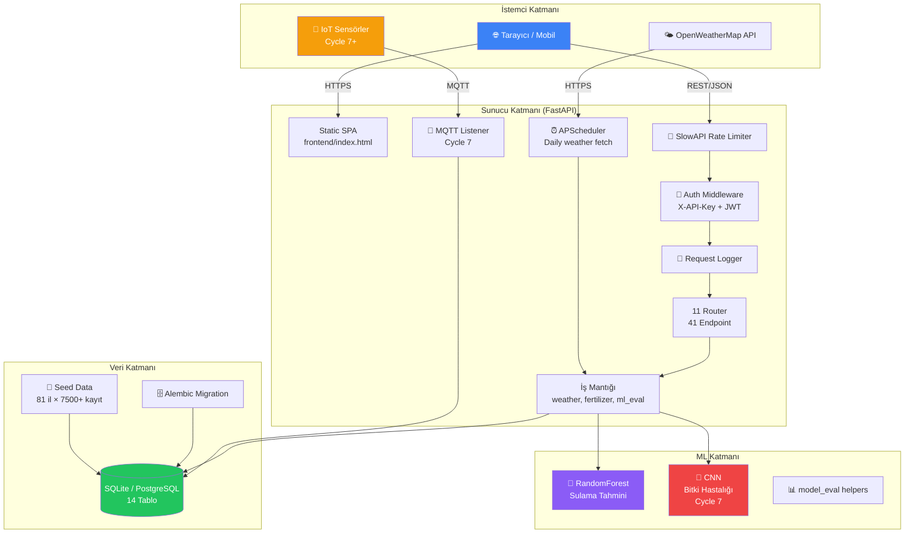
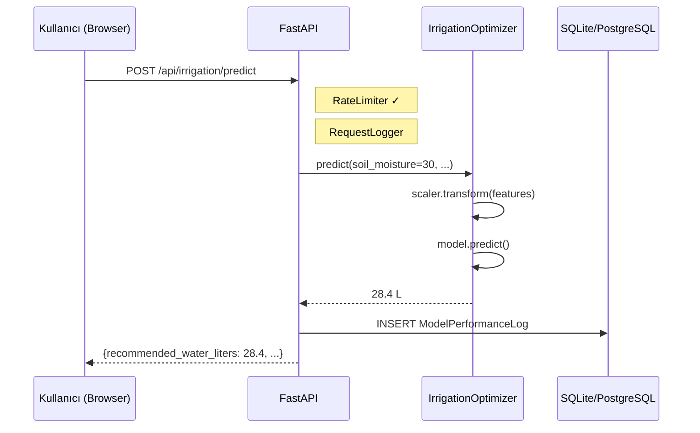
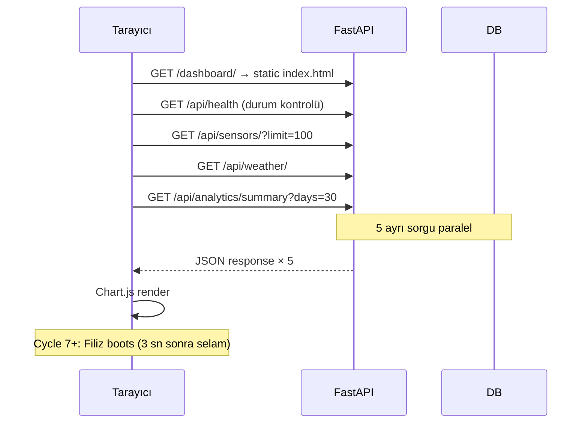
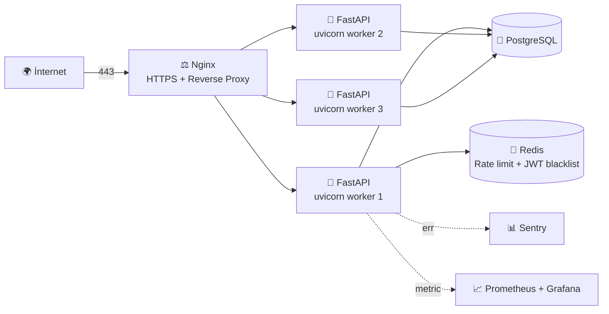
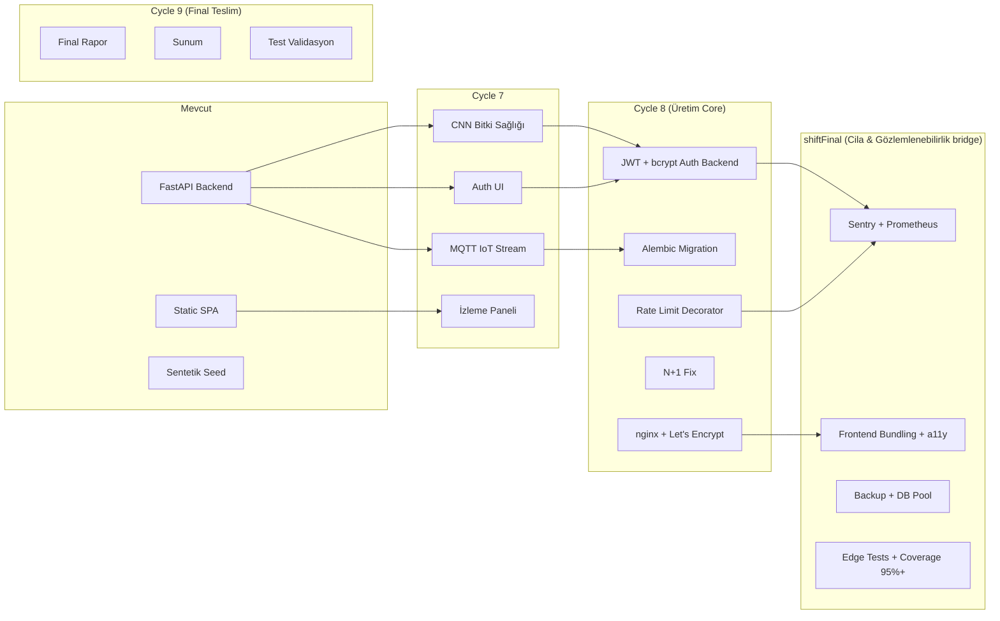

# 🏗️ SFDAP — Sistem Mimarisi

> Bu döküman SFDAP'ın yapı taşlarını ve veri akışını teknik kişiler için
> detaylandırır. README'deki mermaid diyagramının açıklamalı versiyonu.

---

## 📐 Üst Düzey Mimari



---

## 📦 Modül Yapısı

```
app/
├── main.py                    # FastAPI giriş — middleware + router register + lifespan
├── config.py                  # Pydantic-settings (12-factor config)
├── database.py                # SQLAlchemy engine + session + naming convention
│
├── core/
│   └── logger.py              # Loguru kurulumu (LOG_FORMAT=json opsiyonu shiftFinal)
│
├── models/
│   └── models.py              # 14 ORM tablosu (User, Farm, Field, Sensor, ...)
│
├── schemas/
│   └── schemas.py             # 30+ Pydantic request/response modeli
│
├── routers/                   # 11 router, 41 endpoint
│   ├── health.py              # Sığ sağlık (load balancer için)
│   ├── metrics.py             # Derin sağlık (DB+scheduler+ML+freshness+alerts)
│   ├── sensors.py             # Sensör CRUD + readings
│   ├── weather.py             # Hava durumu CRUD + dış API + clean
│   ├── irrigation.py          # ML tahmin + program + auto-log
│   ├── fertilizer.py          # NPK öneri + takvim
│   ├── plants.py              # Bitki sağlığı (URL + CNN multipart)
│   ├── analytics.py           # Toplu istatistik + compare + PDF/Excel export
│   ├── alerts.py              # SystemAlert CRUD (severity filtre)
│   ├── model_performance.py   # Log + summary + timeseries + compare + drift
│   └── auth.py                # Register/login/me/logout (skeleton, Cycle 8 JWT)
│
├── services/                  # İş mantığı
│   ├── weather_service.py     # OpenWeatherMap entegrasyonu + temizleme
│   ├── fertilizer_service.py  # 17 bitki NPK ihtiyaç hesabı
│   ├── report_service.py      # PDF (FPDF) + Excel (openpyxl)
│   ├── data_quality.py        # IQR outlier + missing fill + sensor validation
│   └── mqtt_listener.py       # IoT stream subscriber (Cycle 7 skeleton)
│
├── ml/
│   ├── irrigation_model.py    # RandomForest sulama (sklearn 1.8)
│   ├── plant_disease_model.py # CNN sarıcı (Cycle 7 skeleton, ONNX placeholder)
│   ├── eval.py                # MAE/RMSE/F1/cross-validate helpers
│   └── models/                # *.pkl dosyaları (gitignored)
│
├── middleware/
│   ├── auth.py                # X-API-Key Security
│   ├── rate_limiter.py        # SlowAPI (decorator'lar Cycle 8'de bağlanacak)
│   ├── request_logger.py      # Her isteği loguru'ya yazar
│   └── exceptions.py          # SFDAPError + global handler
│
└── tasks/
    └── scheduler.py           # APScheduler (gece 02:00 hava durumu çek)
```

---

## 🔄 Tipik İstek Akışı

### Senaryo: Çiftçi sulama tahmini istiyor



### Senaryo: Dashboard ana sayfa açılıyor



---

## 🗄️ Veri Modeli — 14 ORM Tablosu

```mermaid
erDiagram
    User ||--o{ Farm : owns
    Farm ||--o{ Field : has
    Farm ||--o{ WeatherData : observes
    Farm ||--o{ SystemAlert : triggers
    Field ||--o{ Sensor : contains
    Field ||--o{ IrrigationSchedule : scheduled
    Field ||--o{ SoilAnalysis : tested
    Field ||--o{ CropPlanting : planted
    Field ||--o{ FertilizerRecommendationLog : recommended
    Field ||--o{ PlantHealthImage : photographed
    Sensor ||--o{ SoilMoistureReading : produces
    CropType ||--o{ CropPlanting : species
    CropType ||--o{ FertilizerRecommendationLog : species

    User { int id PK; string email UK; string password_hash; string role }
    Farm { int id PK; int user_id FK; string city; string region; float lat; float lng }
    Field { int id PK; int farm_id FK; float area_hectares; string soil_type; int crop_id FK }
    Sensor { int id PK; int field_id FK; string sensor_type; string serial_number UK; string status }
    SoilMoistureReading { int id PK; int sensor_id FK; datetime ts; float moisture; float temp }
    WeatherData { int id PK; int farm_id FK; datetime recorded_at; float temp; float humidity }
    IrrigationSchedule { int id PK; int field_id FK; datetime scheduled; int duration_min; string status }
    PlantHealthImage { int id PK; int field_id FK; string image_url; string diagnosis; float confidence }
    SystemAlert { int id PK; int farm_id FK; string severity; string message; bool is_resolved }
    ModelPerformanceLog { int id PK; string model_name; text prediction; float accuracy_score }
    SoilAnalysis { int id PK; int field_id FK; float ph; float n; float p; float k }
    CropPlanting { int id PK; int field_id FK; int crop_id FK; date planting_date }
    CropType { int id PK; string name; float ph_min; float ph_max; int growth_days }
    FertilizerRecommendationLog { int id PK; int field_id FK; int crop_id FK; float n_kg; float p_kg; float k_kg }
```

---

## 🔁 Otomatik İş Akışları

### APScheduler periyodik görevler

| Görev | Trigger | Açıklama |
|:--|:--|:--|
| `fetch_daily_weather` | Cron `02:00` | Tüm 81 ilden OpenWeatherMap'e istek + DB'ye yaz |
| `aggregate_old_readings` | Haftalık (Cycle 7+) | 30+ günlük sensör okumalarını günlük özet tabloya taşı |
| `model_drift_check` | Günlük (Cycle 8+) | Tüm aktif modeller için drift endpoint'ini çağır |

### Auto-logging

| Tetikleyici | Hedef Tablo | Notlar |
|:--|:--|:--|
| `POST /api/irrigation/predict` | `ModelPerformanceLog` | model_name='irrigation_rf', input + output JSON |
| `POST /api/plants/health-images/analyze` | `PlantHealthImage` + `ModelPerformanceLog` | (Cycle 7'de plant_disease_cnn auto-log) |

---

## 🔐 Güvenlik Katmanları

```
┌─────────────────────────────────────────────────────────┐
│  1. CORS                  (settings.CORS_ORIGINS)       │
├─────────────────────────────────────────────────────────┤
│  2. Rate Limiter          (slowapi, decorator Cycle 8)  │
├─────────────────────────────────────────────────────────┤
│  3. Request Logger        (loguru, her istek için)      │
├─────────────────────────────────────────────────────────┤
│  4. Auth Middleware                                      │
│     - X-API-Key  (POST/DELETE)                          │
│     - JWT Bearer (Cycle 8'de full)                      │
├─────────────────────────────────────────────────────────┤
│  5. Pydantic Validation   (request body schema)         │
├─────────────────────────────────────────────────────────┤
│  6. SQLAlchemy ORM        (parameterized queries)       │
├─────────────────────────────────────────────────────────┤
│  7. Global Exception      (custom error format)         │
└─────────────────────────────────────────────────────────┘
```

---

## 🚀 Deploy Topolojisi (Cycle 8 hedef)



---

## 📊 Performans Hedefleri

| Endpoint | Hedef p95 | Mevcut |
|:--|:--:|:--:|
| `GET /api/health` | < 10 ms | ✓ |
| `GET /api/sensors/?limit=100` | < 100 ms | ✓ |
| `GET /api/analytics/summary` | < 500 ms | ⚠️ N+1 sorgu (Cycle 8 fix) |
| `POST /api/irrigation/predict` | < 100 ms | ~50 ms ✓ |
| `GET /api/health/deep` | < 200 ms | ~60 ms ✓ |

---

## 🔮 Cycle 7+ Genişlemeler



---

## 📚 İlgili Dökümanlar

- [`README.md`](../README.md) — proje genel bakış, kurulum, kullanım
- [`projeakisi.md`](../projeakisi.md) — cycle bazlı görev dağılımı
- [`CONTRIBUTORS.md`](../CONTRIBUTORS.md) — ekip + cycle metrikleri
- [`docs/api/API_Kullanim_Kilavuzu.md`](api/API_Kullanim_Kilavuzu.md) — API kullanım rehberi
- [`docs/demo_script.md`](demo_script.md) — sunum demo senaryosu
